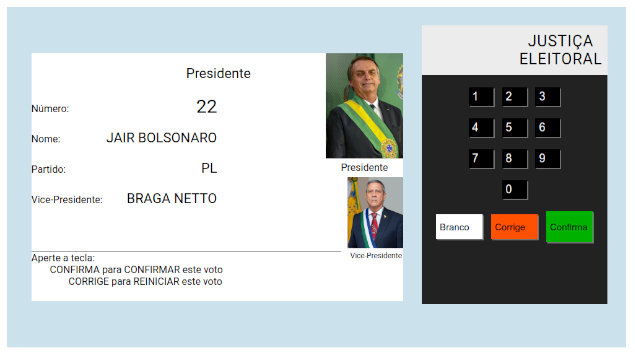

# Urna Eletrônica

Uma urna eletrônica feita usando javascript e PHP. Este projeto ainda está em desenvolvimento, pretendo deixá-lo melhor e mais completo futuramente.

### Próximas atualizações:
- [ ] Adicionar opção de votos nulos
- [ ] Adicionar mais candidatos
- [ ] Melhorias no front end
- [ ] Melhorias no back end

## Requisitos 
Caso você deseje testar essa urna, tenha o PHP instalado em sua máquina e algum ambiente de servidor web local como o xampp.